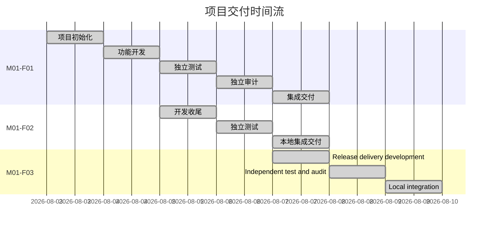

# 项目时间流

| 任务 | 内部 ID | 开始时间 | 最近更新 | 状态 | 当前阶段 | 集成时间 | 完成时间 | 快照标签 | 报告路径 |
| --- | --- | --- | --- | --- | --- | --- | --- | --- | --- |
| Release delivery artifacts and deployment scripts | M01-F03 | 2026-08-07 | 2026-08-07 | Local integration complete | Local delivery complete | 2026-08-07 | 2026-08-07 | - | `tasks/m01-f03-release-delivery-v1/integration-report.md` |
| 应届机试题-计算器业务需求包 v1.0 | M01-F01 | 2026-08-03 | 2026-08-03 | 已完成 | 本地集成交付完成 | 2026-08-03 | 2026-08-03 | 无（未创建标签） | `tasks/m01-f01-calculator-v1/` |
| 计算器桌面化增强与个性化配置 v1.1 | M01-F02 | 2026-08-05 | 2026-08-05 | 已完成 | 本地集成交付完成 | 2026-08-05 | 2026-08-05 | 无（未创建标签） | `tasks/m01-f02-calculator-desktop-v1-1/` |
