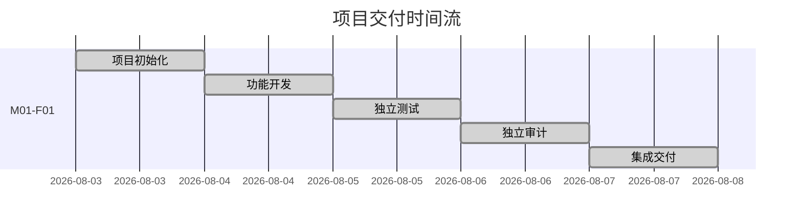

# 项目时间流

| 任务 | 内部 ID | 开始时间 | 最近更新 | 状态 | 当前阶段 | 集成时间 | 完成时间 | 快照标签 | 报告路径 |
| --- | --- | --- | --- | --- | --- | --- | --- | --- | --- |
| 应届机试题-计算器业务需求包 v1.0 | M01-F01 | 2026-08-03 | 2026-08-03 | 已完成 | 本地集成交付完成 | 2026-08-03 | 2026-08-03 | 无（未创建标签） | `tasks/m01-f01-calculator-v1/` |
